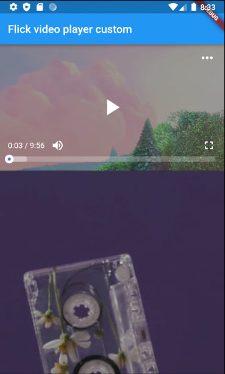
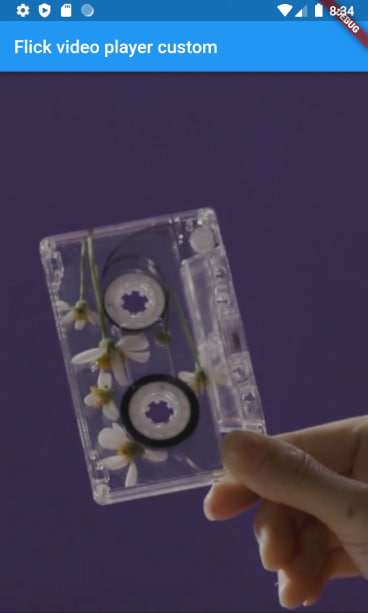
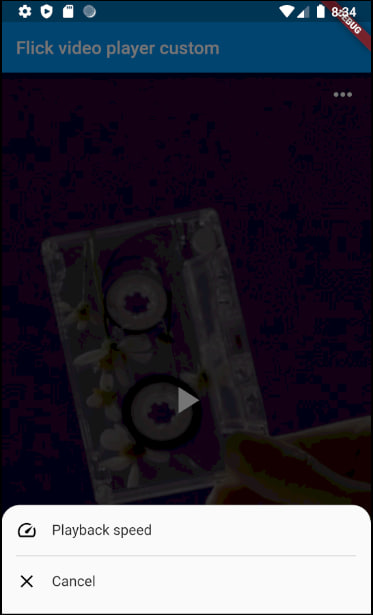
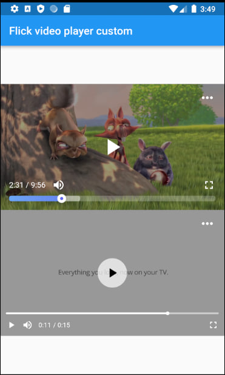

# [**Based on Flick Video Player**](https://pub.dev/packages/flick_video_player)


# Flick Video Player Custom

Flick Video Player Custom is a video player for flutter.
The [video_player](https://pub.dev/packages/video_player) plugin gives low level access for the video playback. Flick Player wraps `video_player` under the hood and provides base architecture for developers to create their own set of UI and functionalities.

# Features Custom

* Overlay opens when touching video
* Change video speed
* More custom menu options
* Edit the slide bar interface
* Edit full screen

# Demo Mobile

### Aspect ratios for video 16: 9


### Aspect ratios for video 9: 16


##### Setting sheet


### More UI controller video,dark overlay  below video


### Installation
Add the following dependencies in your pubspec.yaml file of your flutter project.
```dart
    flick_video_player_custom: <latest_version>
    video_player: <latest_version>
```

### How to use
Create a `FlickManager` and pass the manager to `FlickVideoPlayer`, make sure to dispose `FlickManager` after use. 
```dart 
import 'package:flutter/material.dart';
import 'package:flick_video_player_custom/flick_video_player.dart';
import 'package:video_player/video_player.dart';

class MyHomePage extends StatefulWidget {
  const MyHomePage({super.key, required this.title});

  final String title;

  @override
  State<MyHomePage> createState() => _MyHomePageState();
}

class _MyHomePageState extends State<MyHomePage> {

  late FlickManager flickManager1;
  late FlickManager flickManager2;

  @override
  void initState() {
       super.initState();
       flickManager1 =   FlickManager(
           videoPlayerController:
           VideoPlayerController.network("https://storage.googleapis.com/gtv-videos-bucket/sample/BigBuckBunny.mp4"),
           additionalOptions: [OptionModel(icon: Icons.hd, onPressFeature: () {}, name: 'Quality')]);

       flickManager2 = FlickManager(
         videoPlayerController:
         VideoPlayerController.network("http://commondatastorage.googleapis.com/gtv-videos-bucket/sample/ForBiggerMeltdowns.mp4"),
       );
  }

  @override
  void dispose() {
    flickManager1.dispose();
    flickManager2.dispose();
    super.dispose();
  }

  @override
  Widget build(BuildContext context) {
    return Scaffold(
      appBar: AppBar(
        title: Text(widget.title),
      ),
      body: Center(
        child: SingleChildScrollView(
          child: Column(
            mainAxisAlignment: MainAxisAlignment.center,
            children: <Widget>[
              FlickVideoPlayer(
                  flickManager: flickManager1),
              FlickVideoPlayer(
                flickManager: flickManager2,
                flickVideoWithControls: const FlickVideoWithControls(
                  videoFit: BoxFit.fitWidth,
                  controls: FlickPortraitControls(),
                ),
                flickVideoWithControlsFullscreen: const FlickVideoWithControls(
                  controls: FlickLandscapeControls(),
                ),
              ),
            ],
          ),
        ),
      ),
    );
  }
}
```
